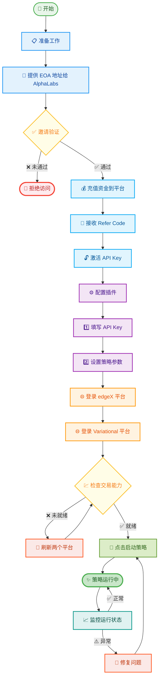

# 📊 插件配置流程图

[English](./plugin-configuration-flowchart-EN.md) | **中文**

## 🔄 详细配置流程

## 📝 步骤详解

### 1️⃣ 准备阶段
- 确保有 AlphaLabs 邀请链接
- 准备好 EOA 钱包地址
- 准备充值资金

### 2️⃣ 验证激活
- 提交 EOA 地址进行邀请验证
- 验证通过后充值资金
- 获取并激活 API Key

### 3️⃣ 插件配置
- 在插件中输入 API Key
- 根据社区说明设置策略参数
- 保存配置信息

### 4️⃣ 平台准备
- 使用浏览器登录 edgeX
- 使用浏览器登录 Variational
- 确保两个平台都显示可交易状态
- 必要时刷新页面

### 5️⃣ 启动运行
- 点击"启动策略"按钮
- 监控初始运行状态
- 确认策略正常运行

## ⚠️ 注意事项

- 🔐 **安全提醒**：妥善保管 API Key，不要分享给他人
- 💡 **最佳实践**：两个平台使用相同的 EOA 地址
- 📊 **监控建议**：定期检查策略运行状态
- 🛠️ **故障处理**：遇到问题先检查配置，再联系社区支持