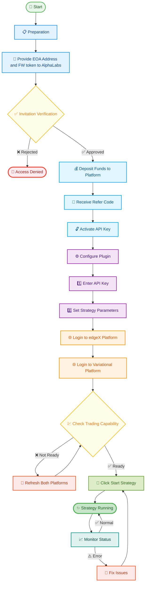

# 📊 Plugin Configuration Flowchart

**English** | [中文](./plugin-configuration-flowchart-CN.md)

## 🔄 Detailed Configuration Flow

## 📝 Step-by-Step Guide

### 1️⃣ Preparation Phase
- Ensure you have AlphaLabs invitation link
- Prepare your EOA wallet address
- Prepare funds for deposit

### 2️⃣ Verification & Activation
- Submit EOA address for invitation verification
- Deposit funds after approval
- Receive and activate API Key

### 3️⃣ Plugin Configuration
- Enter API Key in plugin
- Set strategy parameters according to community guidelines
- Save configuration

### 4️⃣ Platform Setup
- Login to edgeX using browser
- Login to Variational using browser
- Ensure both platforms show trading capability
- Refresh pages if necessary

### 5️⃣ Launch & Run
- Click "Start Strategy" button
- Monitor initial running status
- Confirm strategy is running properly

## ⚠️ Important Notes

- 🔐 **Security**: Keep your API Key safe, never share with others
- 💡 **Best Practice**: Use the same EOA address for both platforms
- 📊 **Monitoring**: Regularly check strategy running status
- 🛠️ **Troubleshooting**: Check configuration first, then contact community support